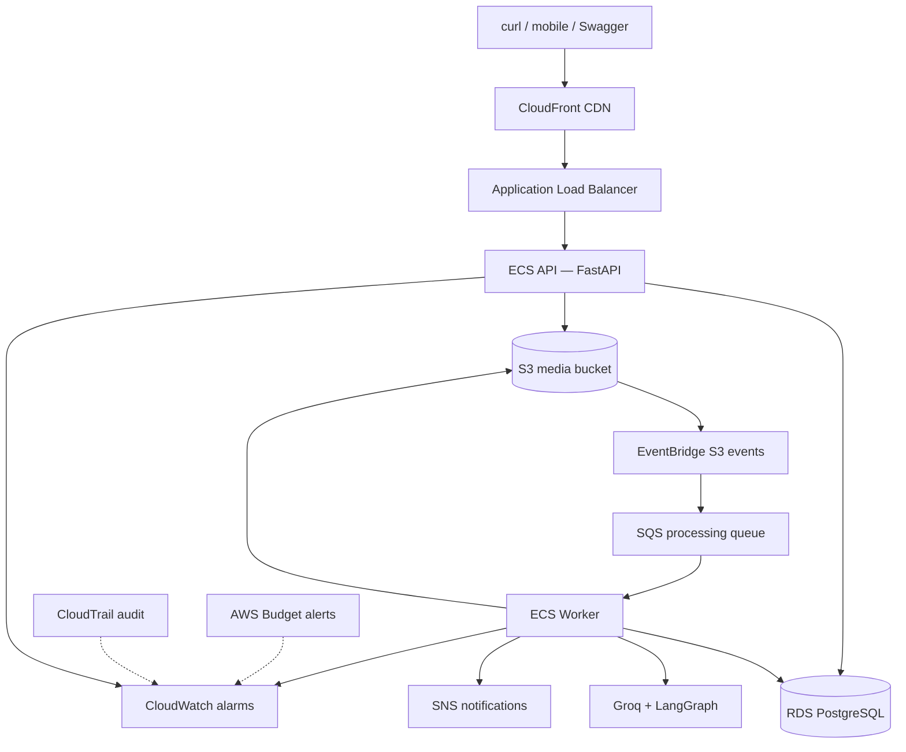

# AI Media Processing Platform

[](https://github.com/hayk-work/ai_media_platform/actions/workflows/ci.yml)

A mini Google Photos–style platform: users upload images, AWS processes them
asynchronously, and clients receive thumbnails, metadata, and AI-generated captions
and tags.

Built as a **production-minded AWS portfolio project** with Infrastructure as Code,
async workers, CDN delivery, monitoring, audit logging, and automated tests.

## Live demo

| Resource | URL |
| -------- | --- |
| **API (HTTPS via CloudFront)** | https://d2rhsorulu1z8s.cloudfront.net |
| **Swagger UI** | https://d2rhsorulu1z8s.cloudfront.net/docs |
| **Health check** | https://d2rhsorulu1z8s.cloudfront.net/health |
| **ALB (direct HTTP)** | http://ai-media-platform-api-alb-458236488.us-east-1.elb.amazonaws.com |

Try the automated demo script (create the practice photo first):

```bash
python3 scripts/create-demo-photo.py
chmod +x scripts/demo.sh
./scripts/demo.sh
```

See [docs/demo.md](docs/demo.md) for the full upload → process → AI flow and how to
record a terminal GIF for your portfolio.


## Architecture




### What happens on upload

1. Client registers/logs in (JWT).
2. API creates a media record and returns a **presigned S3 URL**.
3. Client uploads directly to S3.
4. **EventBridge** routes the S3 event to **SQS**.
5. **Worker** generates a thumbnail, runs **AI analysis**, updates RDS, and sends
   **SNS** notification.
6. Client lists media and receives a **CloudFront** thumbnail URL.

## Tech stack

| Layer | Technology |
| ----- | ---------- |
| API | FastAPI, SQLAlchemy, Alembic, JWT |
| Worker | Async SQS consumer, Pillow |
| AI | LangGraph workflow, Groq vision model |
| Data | PostgreSQL (RDS), S3 |
| AWS | ECS Fargate, ALB, CloudFront, SQS, SNS, EventBridge |
| Ops | CloudWatch alarms, structured logs, CloudTrail, AWS Budgets |
| IaC | CloudFormation nested stacks |
| Local dev | Docker Compose |
| CI | GitHub Actions (pytest + ruff) |

## Monitoring and cost alerts

The platform includes operational visibility built into the infrastructure:

**CloudWatch alarms** (via `infrastructure/monitoring.yaml`):

- SQS backlog and oldest message age
- API target 5xx errors
- RDS CPU and connection count

**CloudTrail** — management API audit trail with log file validation.

**AWS Budget** — monthly cost budget (default $50) with optional email alerts at
80% and 100%. Set `BUDGET_NOTIFICATION_EMAIL` when deploying the network stack:

```bash
export BUDGET_NOTIFICATION_EMAIL=you@example.com
./infrastructure/scripts/deploy.sh
```

Verify alarms:

```bash
aws cloudwatch describe-alarms --alarm-name-prefix ai-media-platform-
```

## Quick start (local)

1. Copy environment variables:

   ```bash
   cp .env.example .env
   ```

2. Start all services:

   ```bash
   docker compose up --build
   ```

3. Verify health:

   ```bash
   curl http://localhost:8000/health
   ```

4. Open API docs: [http://localhost:8000/docs](http://localhost:8000/docs)

PostgreSQL is exposed on host port **5433** (mapped to 5432 inside Docker).

## API flow

```bash
# Register
curl -X POST http://localhost:8000/auth/register \
  -H "Content-Type: application/json" \
  -d '{"email":"demo@example.com","password":"strong-password-123"}'

# Login
curl -X POST http://localhost:8000/auth/login \
  -H "Content-Type: application/json" \
  -d '{"email":"demo@example.com","password":"strong-password-123"}'

# Request upload (use access_token from login)
curl -X POST http://localhost:8000/uploads \
  -H "Authorization: Bearer <access_token>" \
  -H "Content-Type: application/json" \
  -d '{"filename":"photo.jpg","content_type":"image/jpeg","file_size_bytes":1024}'

# List media
curl http://localhost:8000/media -H "Authorization: Bearer <access_token>"
```

## Project structure

```text
backend/
  api/              FastAPI application and Alembic migrations
  worker/           SQS consumer — thumbnails, AI, notifications
  common/           Shared config, models, database, logging
infrastructure/     CloudFormation templates and deploy scripts
docs/               Architecture diagrams and demo guide
scripts/            Demo and utility scripts
```

## Features

| Area | Capabilities |
| ---- | ------------ |
| **Auth** | JWT register, login, logout, protected routes |
| **Uploads** | S3 presigned URLs, direct client-to-bucket upload |
| **Processing** | EventBridge → SQS → ECS worker, thumbnails, status tracking |
| **AI** | LangGraph workflow with Groq vision (caption + tags) |
| **Notifications** | SNS alerts when processing completes |
| **CDN** | CloudFront for API and processed media delivery |
| **Ops** | CloudWatch alarms, structured logs, CloudTrail audit, cost budgets |
| **IaC** | CloudFormation nested stacks, deploy scripts, template tests |

## Tests and linting

```bash
python -m venv .venv && source .venv/bin/activate
pip install -r requirements.txt -r requirements-dev.txt
pytest
ruff check backend
```

CI runs on every push/PR to `main` with PostgreSQL, migrations, pytest, and ruff.

## AWS deployment

See [infrastructure/README.md](infrastructure/README.md) for the full deploy guide.

```bash
# 1. Network + CloudTrail + Budget
export DEPLOY_BUCKET=your-cfn-artifacts-bucket
export BUDGET_NOTIFICATION_EMAIL=you@example.com  # optional
./infrastructure/scripts/deploy.sh

# 2. API + worker + RDS + S3 + monitoring
./infrastructure/scripts/deploy-api.sh
```

## What I learned

Building this project end-to-end taught me:

- **Designing async pipelines** — decoupling upload (API) from processing (worker)
  with SQS, and using S3 events instead of polling.
- **AWS networking** — public/private subnets, NAT egress, security groups, and
  why RDS and workers stay off the public internet.
- **IaC with nested stacks** — splitting CloudFormation by concern (network, API,
  processing, monitoring) and exporting outputs for downstream stacks.
- **Operational thinking** — structured logs for traceability, CloudWatch alarms
  for backlog and error detection, CloudTrail for audit, and budgets for cost
  awareness.
- **CDN integration** — serving processed media via CloudFront with origin access
  controls instead of public S3 buckets.
- **AI in production workflows** — wrapping Groq vision calls in a LangGraph
  graph with retries, mock mode for tests, and persisting results alongside media
  metadata.
- **Testing across layers** — unit tests with mocks, CloudFormation template tests,
  and integration tests against a real PostgreSQL instance in CI.

## License

MIT — see repository for details.
